# Procesverslag
Markdown is een simpele manier om HTML te schrijven.  
Markdown cheat cheet: [Hulp bij het schrijven van Markdown](https://github.com/adam-p/markdown-here/wiki/Markdown-Cheatsheet).

Nb. De standaardstructuur en de spartaanse opmaak van de README.md zijn helemaal prima. Het gaat om de inhoud van je procesverslag. Besteedt de tijd voor pracht en praal aan je website.

Nb. Door *open* toe te voegen aan een *details* element kun je deze standaard open zetten. Fijn om dat steeds voor de relevante stuk(ken) te doen.

## Jij

  
uitwerken voor kick-off werkgroep

  ### Auteur:
  Jaouad Afkerin

  #### Je startniveau:
  Blauwe piste

  #### Je focus:
  Surface plane

## Je website

  
uitwerken voor kick-off werkgroep

  ### Je opdracht:
  Site van Ajax:
  https://www.ajax.nl

  #### Screenshot(s) van de eerste pagina (small screen):
  Homepagina
  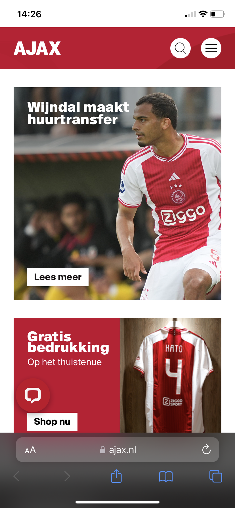
  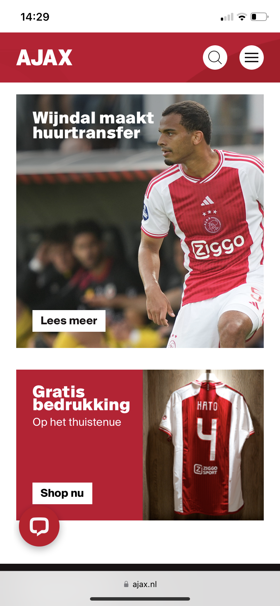
  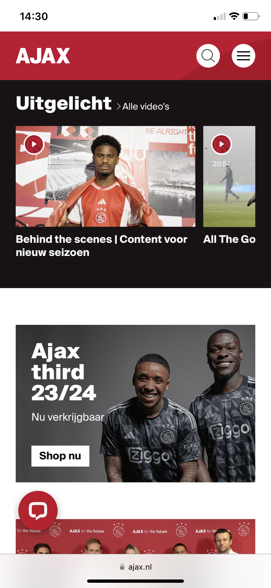
  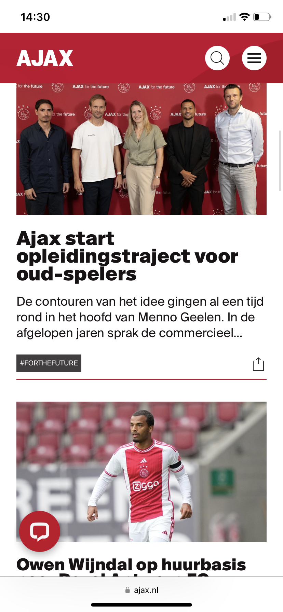
  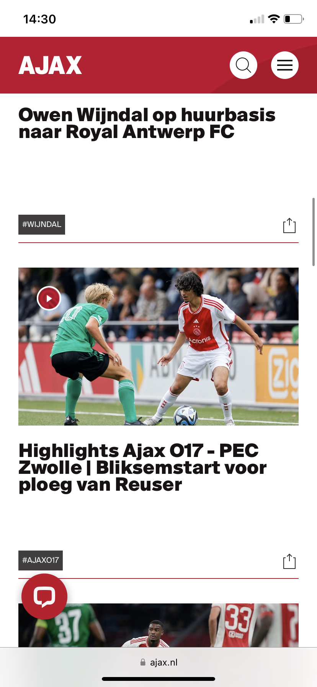
  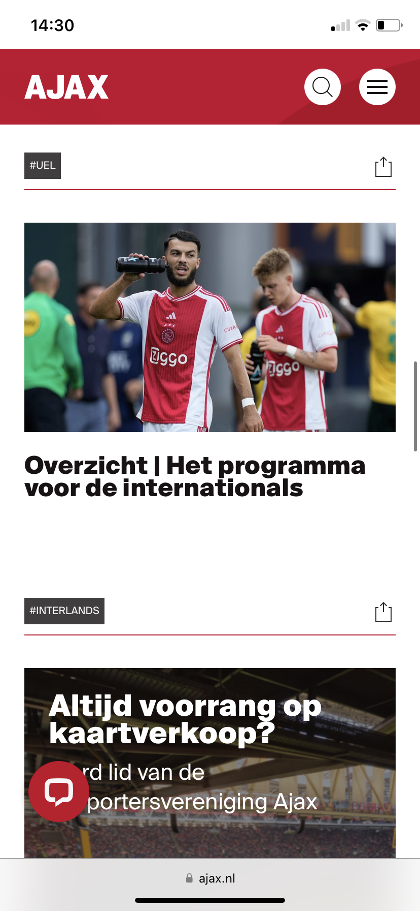
  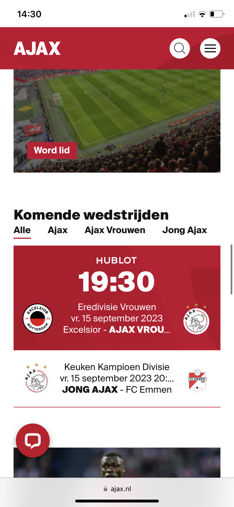
  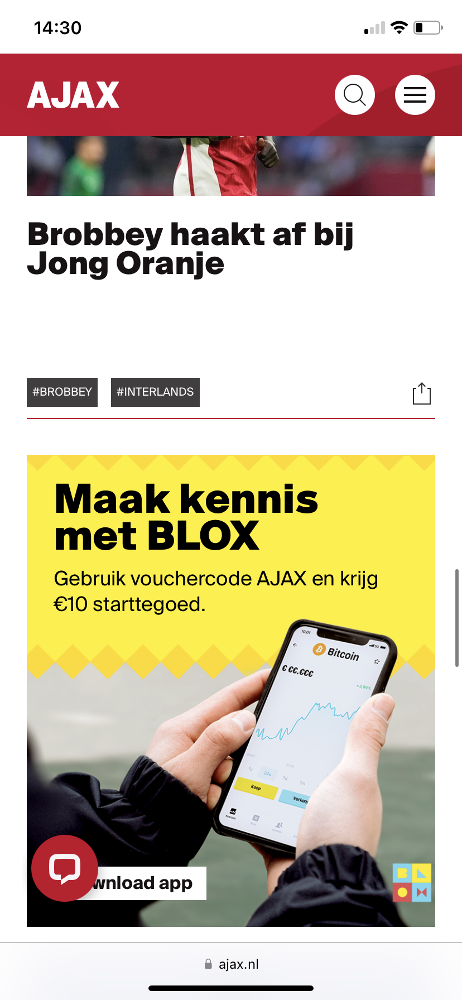
  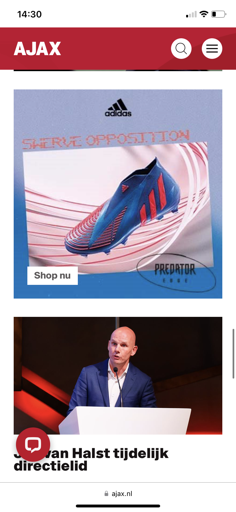

  #### Screenshot(s) van de tweede pagina (small screen):
  Sponsors & Partners
  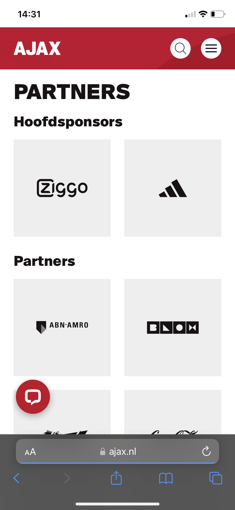
  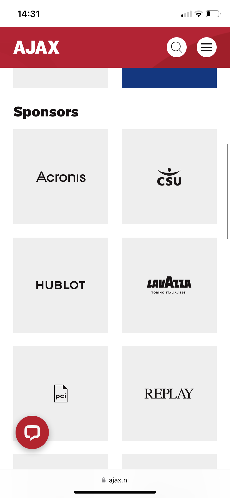

## Toegankelijkheidstest 1/2 (week 1)

  
uitwerken na test in 2e werkgroep

  ### Bevindingen
  Lijst met je bevindingen die in de test naar voren kwamen:

## Breakdownschets (week 1)

  
uitwerken na afloop 3e werkgroep

  ### de hele pagina:
  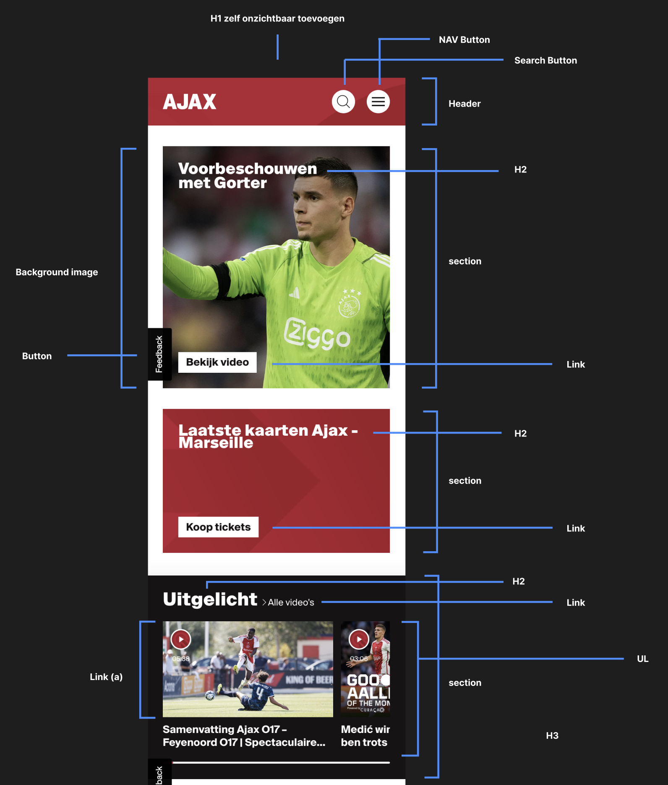
  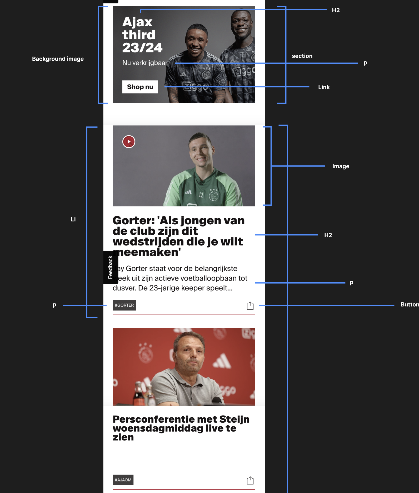
  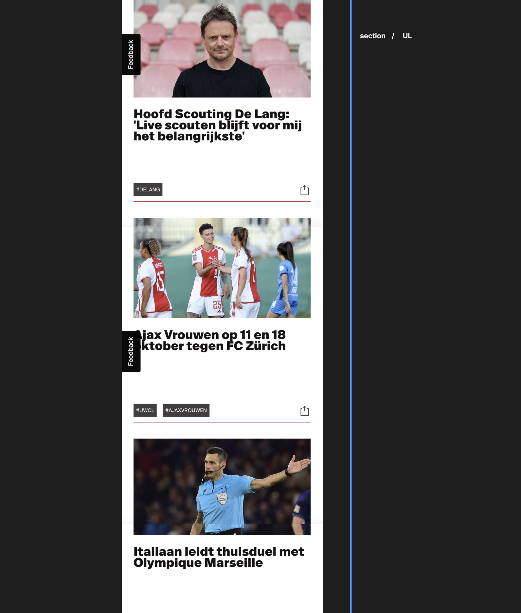
  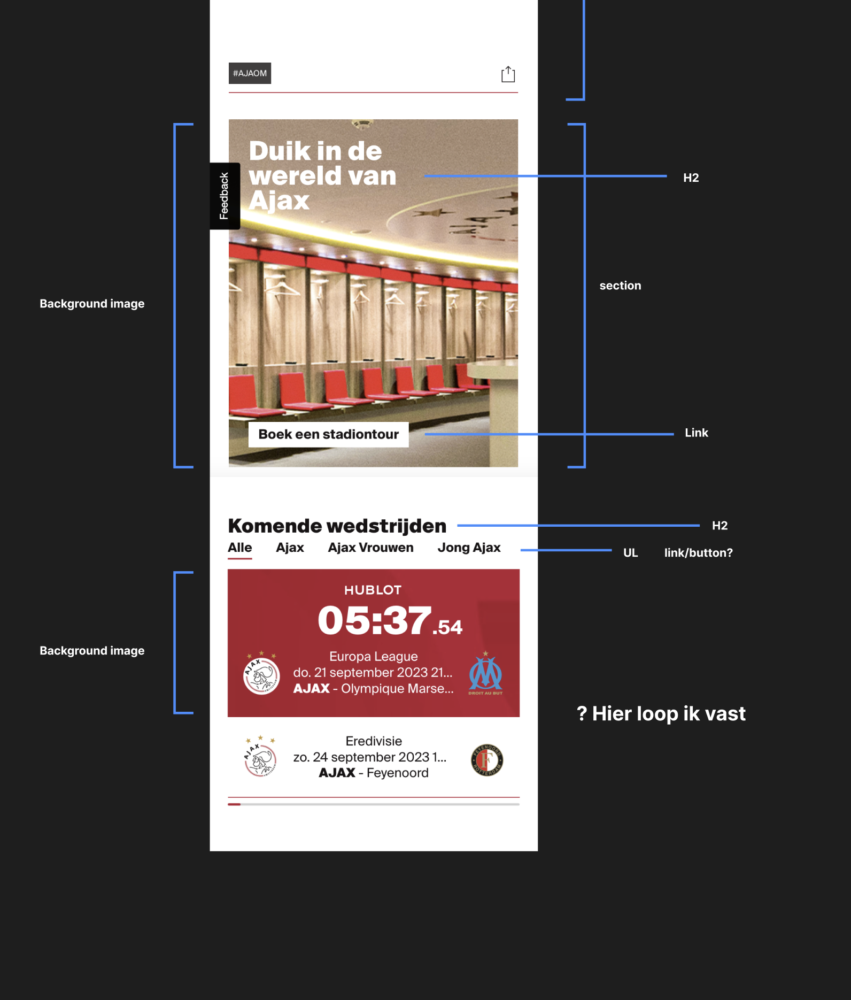

  ### dynamisch deel (bijv menu):
  

  ### wellicht nog een dynamisch deel (bijv filter):
  

## Voortgang 1 (week 2)

  
uitwerken voor 1e voortgang

  ### Stand van zaken
  HTML:
  De basis van de html ging voor mijn gevoel opzich prima. Het is niet al te lastig als je stap voor stap alles langs gaat. Wel heb ik nog
  twijfels over of ik op de juiste plekken de juiste waarde heb gebruikt.
  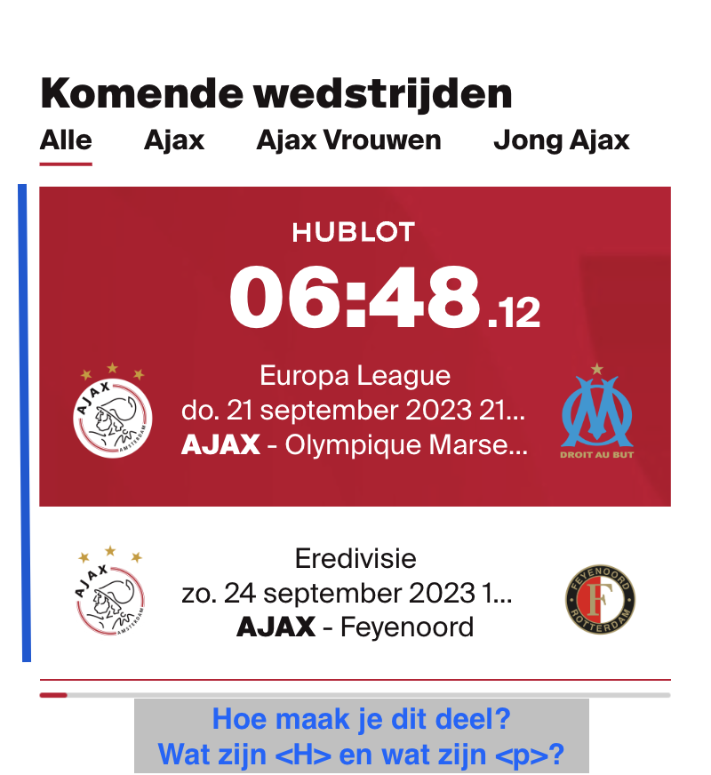

  CSS:
  Met de CSS ben ik nog niet ver gekomen. Ik wilde eigenlijk beginnen met de media querries, maar daar kom ik nog niet helemaal uit. Vooral
  hoe je de content passend maakt voor in een klein scherm.

  ### Agenda voor meeting
  samen met je groepje opstellen

  | Jaouad      
    - Onduidelijk hoe ik een stukje content in moet delen in html(zie afbeelding) 
    - Hulp nodig bij Media Querries. Content voor klein scherm.

  | Chloe          
    - Opmaak van menu in html zetten?
    - H3 link maken die niet linkt naar een pagina.
    - Hoe kan ik de li juist aanspreken om flexbasis en flexgrow toe te passen?

  | Malik        
    - Hoe moet ik een hamburger menu uitwerken in html?
    - Wanneer bepaal je of iets een H2, H3 of P is?

  | Donna        
    - Hoe laat je een menu eruit komen als je er op klikt?

  ### Verslag van meeting
  hier na afloop snel de uitkomsten van de meeting vastleggen

  - punt 1
  - punt 2
  - nog een punt
- ...

## Voortgang 2 (week 3)

  
uitwerken voor 2e voortgang

  ### Stand van zaken
  Ik loop helemaal vast met de css. Krijg er een totale blackout van. Ik heb moeite met het instellen van de juiste maten van de content en de plek van de content.

  De custom fonts die ik in de css heb gezet pakt hij niet.

  Tijdens de opdrachten en lessen lukt het op zich wel, maar zo in mijn eentje loop ik steeds vast.  

  ### Agenda voor meeting
  samen met je groepje opstellen

  | Jaouad      
    - Loop helemaal vast met CSS.
    - Zijwaarts scrollen voorkomen.
    - Positionering van content.
    - Custom font pakt hij niet.
    - Afbeeldingen sizen naar section/grid?
    - Position absolute/relative gaat niet goed.

  | Chloe          
    - Hoe zorg ik ervoor dat mijn <form> de juiste grote is aan de hand van grid?

  | Malik        
    - Hoe zorg ik ervoor dat mijn gehele pagina, op uitzondering van één element dezelfde padding krijgt?
    - Hoe zorg ik ervoor dat EM juist wordt vertaald naar PX?

  | Donna        
    - Hoe laat je een menu eruit komen als je er op klikt?

  ### Verslag van meeting
  hier na afloop snel de uitkomsten van de meeting vastleggen

  - punt 1
  - punt 2
  - nog een punt
  - ...

## Toegankelijkheidstest 2/2 (week 4)

  
uitwerken na test in 9e werkgroep

  ### Bevindingen
  Lijst met je bevindingen die in de test naar voren kwamen (geef ook aan wat er verbeterd is):

## Voortgang 3 (week 4)

  
uitwerken voor 3e voortgang

  ### Stand van zaken
  hier dit ging goed & dit was lastig (neem ook screenshots op van delen van je website en code)

  ### Agenda voor meeting
  samen met je groepje opstellen

  | student 1      | student 2          | student 3    | student 4        |
  | ---            | ---                | ---          | ---              |
  | dit bespreken  | en dit             | en ik dit    | en dan ik dat    |
  | en dat ook nog | dit als er tijd is | nog een punt | dit wil ik zeker |
  | ...            | ...                | ...          | ...              |

  ### Verslag van meeting
  hier na afloop snel de uitkomsten van de meeting vastleggen

  - punt 1
  - punt 2
  - nog een punt
  - ...

## Eindgesprek (week 5)

  
uitwerken voor eindgesprek

  ### Je uitkomst - karakteristiek screenshots:
  

  ### Dit ging goed/Heb ik geleerd:
  Korte omschrijving met plaatjes

  

  ### Dit was lastig/Is niet gelukt:
  Korte omschrijving met plaatjes

  

## Bronnenlijst

  
continu bijhouden terwijl je werkt

  Nb. Wees specifiek ('css-tricks' als bron is bijv. niet specifiek genoeg).
  Nb. ChatGpT en andere AI horen er ook bij.
  Nb. Vermeld de bronnen ook in je code.

  1. bron 1
  2. bron 2
  3. ...

